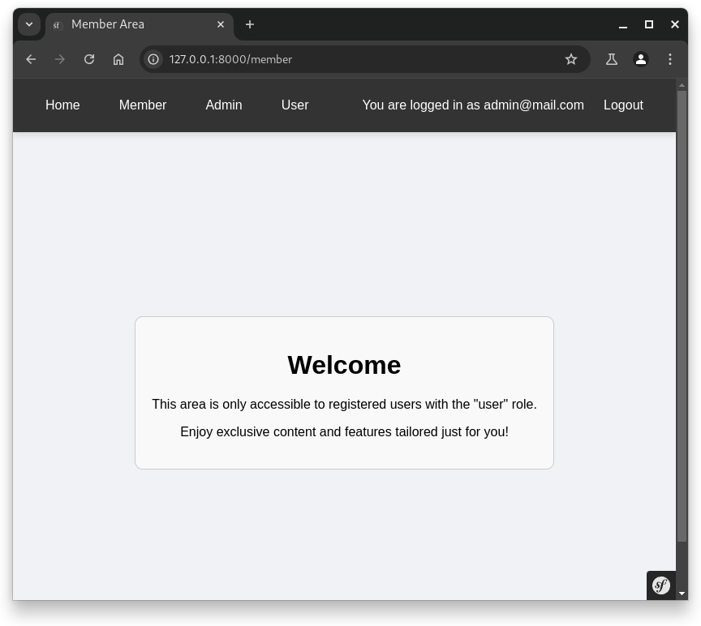
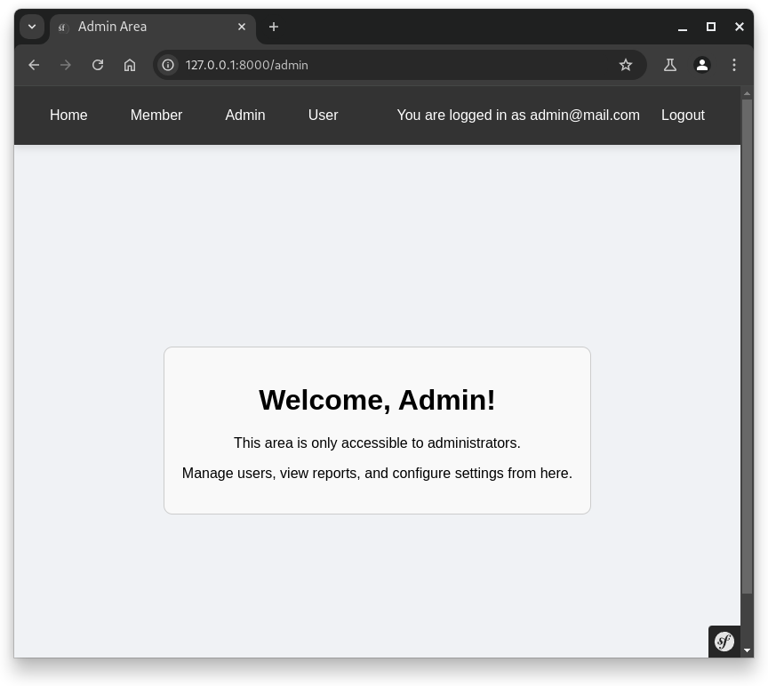
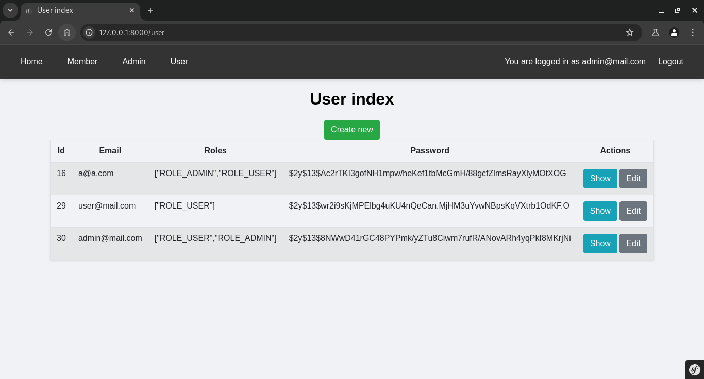
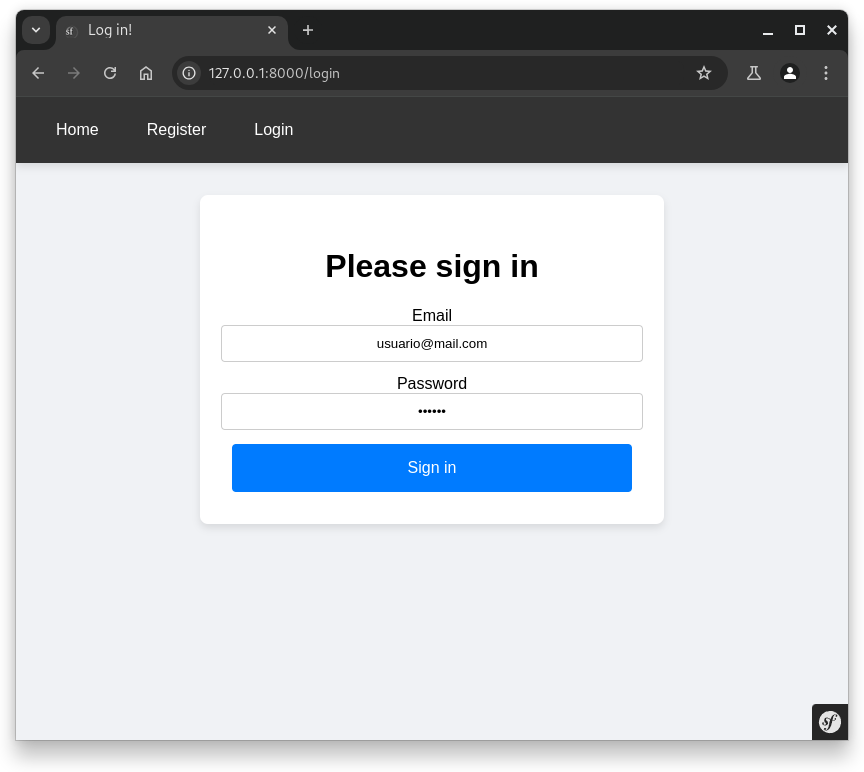
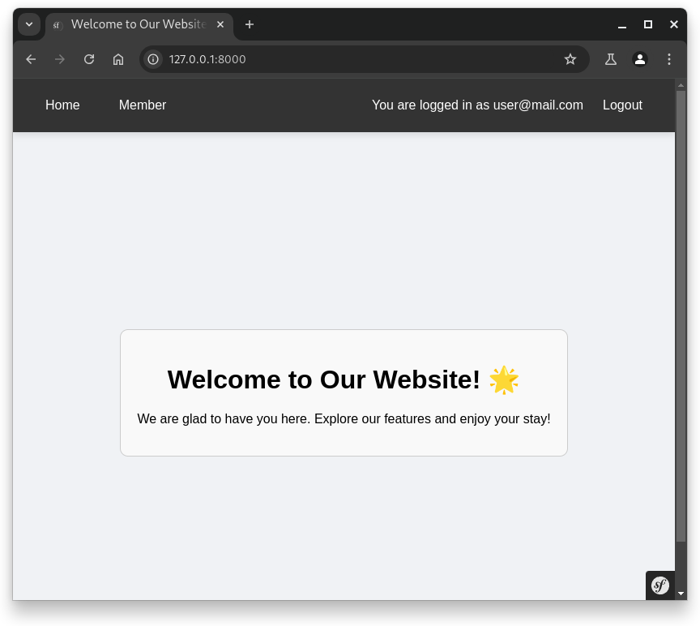

# Symphony Web App

## Descripción
Symphony Web App es una aplicación web desarrollada con Symfony con sección para usuario y administrador.

## Instalación
Para instalar y configurar el proyecto, sigue estos pasos:

1. Clona el repositorio:
    ```bash
    git clone https://github.com/lytsistemas/symphony-example.git
    ```
2. Navega al directorio del proyecto:
    ```bash
    cd symphonyWebApp
    ```
3. Instala las dependencias:
    ```bash
    composer install
    ```
4. Configura el archivo `.env` con tus credenciales de base de datos.

5. Ejecuta las migraciones de la base de datos:
    ```bash
    php bin/console doctrine:migrations:migrate
    ```

## Uso
Para iniciar el servidor de desarrollo, ejecuta:
```bash
php bin/console server:run
```
Luego, abre tu navegador y navega a `http://localhost:8000`.

## Capturas de Pantalla







## Licencia
Este proyecto está licenciado bajo la Licencia MIT. Consulta el archivo `LICENSE` para más detalles.
